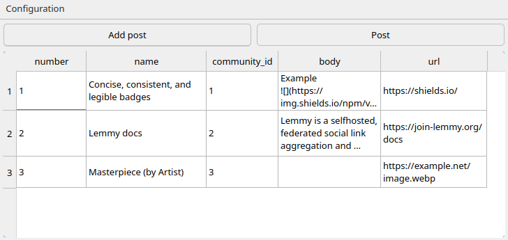

# Lemster

Desktop application for posting to [Lemmy](https://github.com/LemmyNet/lemmy) instances.

## Features
- Simple scheduler
- GUI



# Usage

Click on `configuration` button on menu bar. Put appropriate info. Click `add post`. After clicking `OK` new post will be added in the table. `Post` button will create post on lemmy.

# Build

## Linux

*Requirements:*

- Qt6-base package
- CMake

Run:

```bash
git clone https://github.com/moriar1/lemster
cd lemster
mkdir build
cd build
cmake -DCMAKE_BUILD_TYPE=Debug -DCMAKE_EXPORT_COMPILE_COMMANDS=1 ..
```

if want to run `lemster` only in current directory:

```bash
make
./lemster
``` 

or if you want system-wide install:

```bash
make install # may need sudo
lemster
```

### Windows

Open QtCreator and build the project.

# Uninstall

### Linux

**Delete config files and binary:**

```bash
rm -r $HOME/.local/share/lemster
xargs rm < install_manifest.txt # only if you used `make install`, run from `lemster/build` directory, may need sudo
```

### Windows

**Delete config files**:

On Windows delete one of the following folder:
- `C:/Users/<USER>/AppData/Roaming/lemster`
- `C:/ProgramData/lemster`
- `<APPDIR>/data/lemster`

# TODO:
- [ ] Replace jwt with login+password credentials
- [ ] Replace community ID with community name + Completer.
